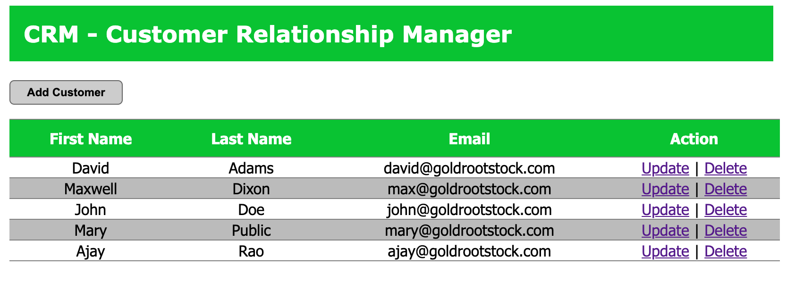
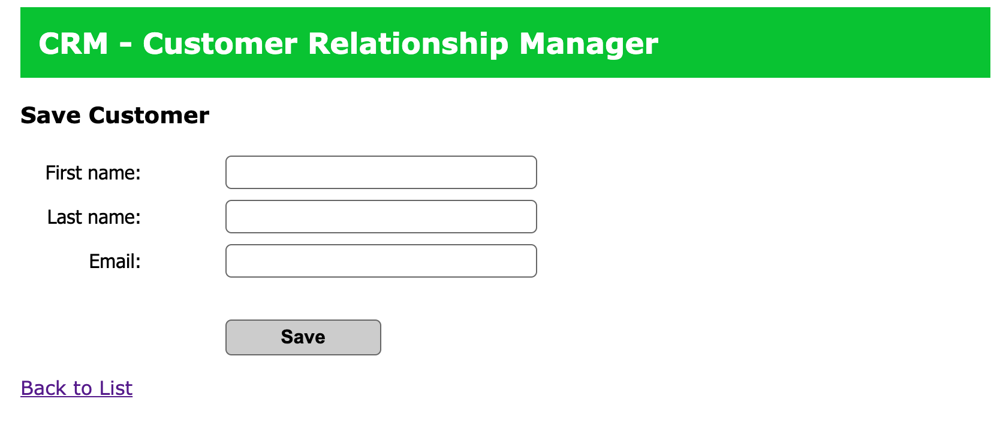
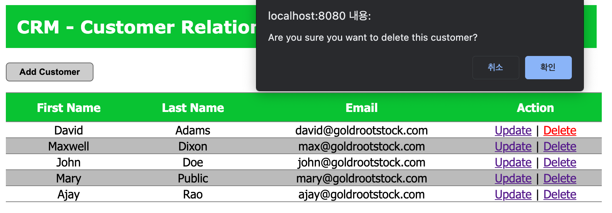

# Customer Relationship Management (in Spring)

Spring MVC web application for tracking customers. 

## Description

This is my first Spring MVC project, which integrates both Spring and Hibernate and have a full working app that talks to MySQL database. 
The application allow to add new customers, manage customers (update, delete, and list all customers).

## Tools & Frameworks

The application is written using Spring MVC framework.

**Database & configuration**
* MySQL
* Tomcat
* Git

**Backend technologies**
* Java
* Spring MVC
* Hibernate ORM

**Frontend technologies**
* HTML, CSS, JavaScript
* JSP, JSTL

## Screenshots

Customer list main page.

Customers can be added and registered.

Pop-up box confirming to delete

